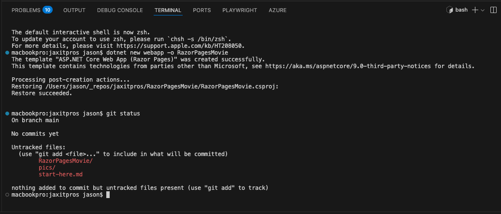
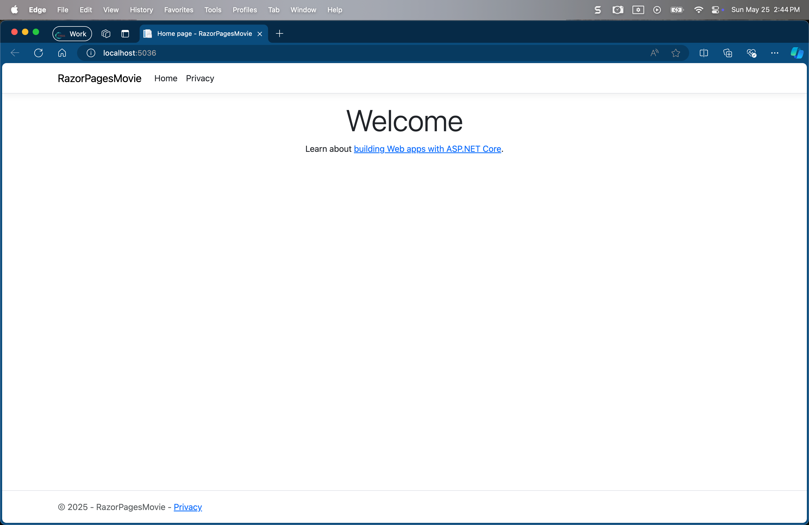

# Create a new ASP.NET Core project

This is going to be a demo of how to build an ASP.NET Core web app with Razor Pages.

 <https://learn.microsoft.com/en-us/aspnet/core/tutorials/razor-pages/razor-pages-start?view=aspnetcore-9.0&tabs=visual-studio-code>

#### ASP stands for Active Server Pages

    It was developed by Microsoft as a server-side scripting technology for creating dynamic and interactive web pages. ASP allows you to embed server-side code (typically written in VBScript or JScript) into HTML pages, which is executed on the server before the page is sent to the client's browser.

### First Command

dotnet new webapp -o RazorPagesMovie
The dotnet new command creates a new Razor Pages project in the RazorPagesMovie folder.

### First Run

